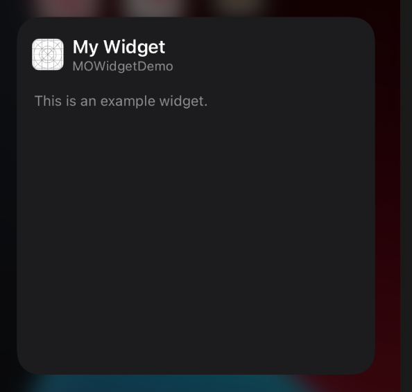

# iOS14_Widget_SwiftUI

​	类似`iWatch`的`运动健康`小组件`Fitness widget`


# 一、创建

## 1、创建主App

​		Xcode -> File -> New -> Project -> iOS -> App -> MOWidgetDemo(起个名...) -> Next

## 2、创建Widget Extension

​		Xcode -> File -> New -> Target -> iOS -> Widget Extension -> 

​		Product Name：MOFitness(起个名...)

​		Include Configuration Intent：该widget是否支持用户自定义，即长按出现的菜单是否有编辑选项

​	（如股票的widget，用户可以选择显示哪只股票）

​			如：未不支持自定义，长按出现的菜单：


​			如：支持自定义，长按出现的菜单：



​		Embed in Application：(表示该widget是哪个target的附属品，如果workspace里有个target就要注意别选错了)  

​		-> Finish

​		此时xcode会询问是否`activate`当前widget的scheme：`Activate`

----

# 二、基本Code

​		下面来看看自动生成的东西：

​		`MOWidget.swift`文件：主要的东西都在这里面（支持自定义的会有Configuration）

​		`MOWidget.intentdefinition`文件：自定义文件（支持自定义才有）

​		。。。（其它的很熟悉就不多说了）

## 	MOWidget.swift

### 1、MOWidget

首先从`@mian`开始看，这是入口。		

```swift
@main
struct MOWidget: Widget { // 同名的Widget
  let kind: String = "MOWidget" // 刷新时用到
  // body：主题内容是什么
  var body: some WidgetConfiguration { 
    // 这里支持两种Configuration：
    // StaticConfiguration：静态的
    // IntentConfiguration：自定义的，会多一个intent参数
    StaticConfiguration(kind: kind, provider: Provider()) { entry in
        MOWidgetEntryView(entry: entry) // 最终展示的View
    }
    .configurationDisplayName("My Widget") // 名字
    .description("This is an example widget.") // 描述
  }
}
```

​		名字和描述在添加时显示：


### 2、MOWidgetEntryView

```swift
struct MOWidgetEntryView : View { // 最终显示的View
  var entry: Provider.Entry // 数据
  var body: some View { // View
    Text(entry.date, style: .time) // 一个文本（类似UILabel）
  }
}
struct SimpleEntry: TimelineEntry {
  let date: Date // 默认的entry里，只带了一个日期
  let configuration: ConfigurationIntent // 支持自定义的还会带个configuration
  // 可以在此加自己需要传入的数据
  let offset: Int // 例：只需要一个offset
}
```
### 3、Provider

​	Provider里有三个方法：

​	placeholder：返回占位的数据源

​	getSnapshot：返回快照的数据源（添加页面显示）

​	getTimeline：返回时间线数组

```swift
func getTimeline(in context: Context, completion: @escaping (Timeline<Entry>) -> ()) {
  var entries: [SimpleEntry] = []
  let currentDate = Date()
  // 每3s刷新一次，一共5次
  for sencondOffset in 0 ..< 5 {
    // 计算每次的时间
    let entryDate = Calendar.current.date(byAdding: .second, value: 3 * sencondOffset, to: currentDate)!
    // 创建entry加如数组
    let entry = SimpleEntry(date: entryDate, offset: sencondOffset)
    entries.append(entry)
  }
  // TimelineReloadPolicy：什么时候调用getTimeline方法
  // atEnd: 在以上entries数组的最后一个entry的时间后，请求新的TimeLine
  // after(Date): 在给定的时间之后请求 
  // never: 不要自动请求
  let timeline = Timeline(entries: entries, policy: .atEnd)
  completion(timeline)
}
// 其实具体什么时候调用，还是系统结合实际情况触发该方法（太频繁的刷新会被限制）
```

可以在`View`里展示`offset`，然后运行，就可以看出什么时候会重新调用`getTimeline`方法了

```swift
struct MOWidgetEntryView : View {
  var entry: Provider.Entry
  var body: some View {
    Text(entry.date, style: .time)
    Text("\(entry.offset)") // 显示当前是第几个3s
  }
}
```
可以根据不同的family返回不同的view：

```swift
struct MOWidgetEntryView : View {
  var entry: Provider.Entry
  @Environment(\.widgetFamily) var family
  
  var body: some View {
    switch family {
    case .systemSmall: MOSmallView(data: MOFitnessData())
    case .systemMedium:
      // GeometryReader 可以获取到系统给当前View所分配的size
      GeometryReader { geometry in 
        HStack {
          MOSmallView(/* parameter */)
            .frame(width: geometry.size.width/2, height: geometry.size.height)
          MOMediumView(/* parameter */)
            .frame(width: geometry.size.width/2, height: geometry.size.height)
        }
      }
    default: Text(entry.date, style: .time)
    }
  }
}
```


----


# 三、刷新

## 1、系统主动刷新

​		一般进入widget说在的主页会触发刷新方法：如：用完app后退到主页面、滑动到widget说在的桌面				

## 2、手动刷新

​		我们可以在主App里触发刷新widget，如：widget展示的东西有所变化时

### 1)、swift文件里刷新

```swift
import WidgetKit // 导入WidgetKit
WidgetCenter.shared.reloadAllTimelines() // 刷新所有的widget
WidgetCenter.shared.reloadTimelines(ofKind: "MOWidget") // 刷新指定的widget
```

### 2)、OC文件里刷新

​		会比较麻烦，参考：[OC主工程刷新WidgetKit 桌面小组件](https://www.jianshu.com/p/0d29623d8f4e)

```swift
import WidgetKit

@objc
@available(iOS 14.0, *)
class WWWidgetManager: NSObject {
  @objc static let shared = WWWidgetManager()
  //MARK: - 刷新所有小组件
  @objc func reloadAllTimelines() {
    #if arch(arm64) || arch(i386) || arch(x86_64)
    WidgetCenter.shared.reloadAllTimelines()
    #endif
  }
  // MARK: - 刷新单个小组件
  @objc func reloadTimelines(kind: String) {
    #if arch(arm64) || arch(i386) || arch(x86_64)
    WidgetCenter.shared.reloadTimelines(ofKind: kind)
    #endif
  }
}
```

```objective-c
#import "MOWidgetDemo-Swift.h"
[[WWWidgetManager shared] reloadAllTimelines];
[[WWWidgetManager shared] reloadTimelines:@"MOWidget"];
```


----

# 四、数据

## 1、数据提供

​	例如：我们需要给widget提供一个数据Model：MOFitnessData

​	可以新建一个文件管理数据源的请求和提供：MODataSource.swift

```swift
struct MODataSouce {
  static let shared = MODataSouce()
  // MARK: 请求数据
  func fetchData(fetchSuccess: @escaping (MOFitnessData) -> Void, fetchFailure: @escaping () -> Void) {
    // 模拟耗时网络请求
    DispatchQueue.main.asyncAfter(deadline: .now() + 1) {
      let success = true
      if success {
        fetchSuccess(MOFitnessData.shared)
      } else {
        fetchFailure()
      }
    }
  }
}
```

​	在`getTimeline`方法里就可以这样使用：

```swift
func getTimeline(for configuration: ConfigurationIntent, in context: Context, completion: @escaping (Timeline<MOSimpleEntry>) -> ()) {
  var entries: [MOSimpleEntry] = []
  let currentDate = Date()
  // 因为是实时的数据，不应提前加载，所以设置1分钟后重新刷新
  let entryDate = Calendar.current.date(byAdding: .minute, value: 1, to: currentDate)!
  MODataSouce.shared.fetchData { (data) in
    // 请求成功
    let entry = MOSimpleEntry(date: entryDate, configuration: configuration, data: data)
    entries.append(entry)
    let timeline = Timeline(entries: entries, policy: .atEnd)
    completion(timeline)
  } fetchFailure: {
    // 请求失败
    let timeline = Timeline(entries: entries, policy: .atEnd)
    completion(timeline)
  }
}
```
补充：跑主App的时候widget的log是打印不出来的，需要先跑起来主app，再跑widget，就看到widget的log了~

----

## 2、数据共享

​	跟主App共享数据可以通过`AppGroup`的方式实现：

​	在开发者账号的官网开启App Group功能，并设置ID；

​	Xcode中主app和widget的 target -> Signing & Capabilities 中添加App Groups，并输入ID。

```swift
class WWAppGroupManager: NSObject {
  static let kAppGroupIdentify = "group.mo.widget"
  static let kUserInfoKey = "user_info"
  
  // MARK: - 保存用户信息
  @objc static func setUserInfo(_ info: [AnyHashable : Any]) {
    let userDefaults = UserDefaults(suiteName: kAppGroupIdentify)
    userDefaults?.setValue(info, forKey: kUserInfoKey)
  }
  
  // MARK: - 获取用户信息
  @objc static func getUserInfo() -> [AnyHashable : Any]? {
    let userDefaults = UserDefaults(suiteName: kAppGroupIdentify)
    guard let info: [AnyHashable : Any] = userDefaults?.value(forKey: kUserInfoKey) as? [AnyHashable : Any] else {
      print("app group: get user nil")
      return nil
    }
    return info
  }
}
```

​	可把这个文件共享给widget target，在做网络请求时直接使用就好了~

----

# 五、SwiftUI

​		数据搞定就得铺UI了，我以为会很复杂，但是当我学了之后，我真的是爱上SwiftUI了，简简单单的几行代码就搞定了很复杂的页面~

## 1、Preview

​		UI调试必备Canvas，打开方式：


​	固定Canvas：Canvas左下角有个📌（Pin Preview），选中就固定显示当前文件的preview了。切换到其它文件修改代码，也可以看到Canvas的实时更新。

​	`PreviewProvider`还可以设置显示的`family`、`device`、等等：

```swift
struct MOWidget_Previews: PreviewProvider {
  static var previews: some View {
    Group {
      ForEach(["iPhone 12 mini", "iPhone 12", "iPhone 12 Pro Max"], id: \.self) { deviceName in
        MOWidgetEntryView(entry: MOSimpleEntry(date: Date(), configuration: ConfigurationIntent(), data: MOFitnessData()))
          .previewContext(WidgetPreviewContext(family: .systemSmall)) // small family
          .previewDevice(PreviewDevice(rawValue: deviceName)) // 显示的设备
        
        MOWidgetEntryView(entry: MOSimpleEntry(date: Date(), configuration: ConfigurationIntent(), data: MOFitnessData()))
          .previewContext(WidgetPreviewContext(family: .systemMedium)) // medium family
          .previewDevice(PreviewDevice(rawValue: deviceName))
      }
    }
  }
}
```


## 2、基础视图
​	View、Text、HStack、VStack、ZStack、Spacer、Circle、等等

​	GeometryReader、alignment、frame、padding、等等

​	之前没学过SwiftUI的同学，可以看看这两个快速入门的视频：[【十五分钟搞懂SwiftUI】布局篇](https://www.bilibili.com/video/BV1Ht4y1y7CE)、[【十五分钟搞懂SwiftUI】样式篇](https://www.bilibili.com/video/BV1o54y1i7xJ)、很快就能看完（磨刀不误砍柴工）

## 3、frame、FontSize适配

​	看各个尺寸上widget的size，这肯定得适配啊：

​	

​	网上找了很久，没找到适配的方案，也就系统自带的字体会根据设置改变，但这与我而言不够。最终想到的法子：

```swift
// SmallView里，运用GeometryReader可以获取到提供的size
var body: some View {
  GeometryReader { geometry in
    Spacer().frame(height: setScreenHeight(geometry.size.height))
  }
}
// Commons.swift
// 全局变量
var kScale: CGFloat = 1.0
// 全局方法
public func setScreenHeight(_ screenHeight: CGFloat) -> CGFloat {
  kScale = screenHeight / 169.0 // 此时比例就保存下来啦
  return 0.0
}
```

​	在后面的UI里，fontSize、height、width、padding等，都可以乘以`kScale`实现自适应啦

​	

## 4、light、dark模式适配

​	新建Color：Assets.xcassets -> + -> Color set -> 可以分别设置light和dark模式下的色值

​	Simulator更改模式：settings -> Developer -> Dark Appearance

## 5、国际化

​	Xcode -> File -> New -> File -> iOS -> String File （或者 Com + N）：Localizable.strings

​	选中Localizable.strings文件，在右边的导航栏点击`Loalize...`按钮 ，再点击 ``Loalize`

​	然后在Project -> Info -> Localiztions 中添加需要支持的语言。。。

```swift
NSLocalizedString("widget.actives", comment: "actives")
```

​	另外widget的name和description直接写key就行，不需要用NSLocalizedString：[参考](https://developer.apple.com/forums/thread/663091)

```swift
...
.configurationDisplayName("widget.name")
.description("widget.description")
```

----

# 六、点击
使用`.widgetURL(URL)`可以给widget添加整体的点击URL，点击会打开主app并触发`scene(_ scene: , openURLContexts URLContexts:)`方法：

```swift
struct MOWidgetEntryView : View {
  var entry: Provider.Entry
  @Environment(\.widgetFamily) var family
  
  var body: some View {
    switch family {
    case .systemSmall:
      MOSmallView(data: MOFitnessData())
        .widgetURL(URL(string: "mo.widget.small"))
    case .systemMedium:
      GeometryReader { geometry in
        HStack {
          MOSmallView(/* parameters */)
            .frame(width: geometry.size.width/2, height: geometry.size.height)
          MOMediumView(/* parameters */)
            .frame(width: geometry.size.width/2, height: geometry.size.height)
        }
        .widgetURL(URL(string: "mo.widget.medium"))
      }
    default: MOSmallView(data: MOFitnessData())
    }
  }
}
```

```swift
func scene(_ scene: UIScene, openURLContexts URLContexts: Set<UIOpenURLContext>) {
  for context in URLContexts {
    print("context: \(context.url)")
  }
}
```
如果需要单独设置点击url，可以使用`Link`，但是`..systemSmall` family 不能单独设置子视图的Link：

```swift
Link(destination: URL(string: "mo.numberView.link")!) {
  MONumberView(data: data)
}
```

# 七、Multiple

## 1、多个Widget

​		用到`WidgetBundle`，最多支持5个。需要把之前widget上的`@main`删除掉，然后：

```swift
@main
struct MOWigets: WidgetBundle {
  var body: some Widget {
    MOWidgetFitness()
    MOWidgetSecond()
    // ...
  }
}
```

## 2、1个Widget支持多个target

​	我的做法是新建了一个widget，Embed到另一个target上，然后跟第一个target共享一切能共享的。

​	（如果有好的方式，请私信or评论告诉我）


自定义后期再研究了：[Making a Configurable Widget](https://developer.apple.com/documentation/WidgetKit/Making-a-Configurable-Widget)

[Demo github 地址](https://github.com/moxiaohui/iOS14_Widget)

参考：

[Creating a Widget Extension](https://developer.apple.com/documentation/WidgetKit/Creating-a-Widget-Extension)

[Keeping a Widget Up To Date](https://developer.apple.com/documentation/WidgetKit/Keeping-a-Widget-Up-To-Date)

[Human Interface Guidelines - Widgets](https://developer.apple.com/design/human-interface-guidelines/ios/system-capabilities/widgets)

[SwiftUI](https://developer.apple.com/documentation/swiftui)

