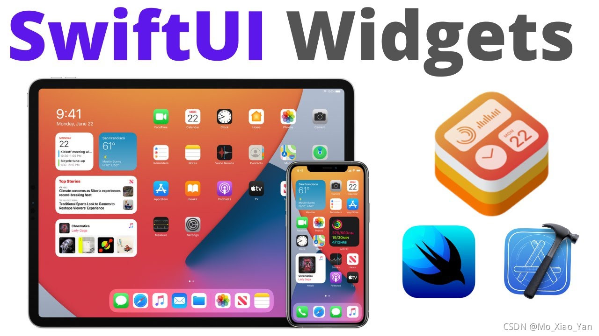
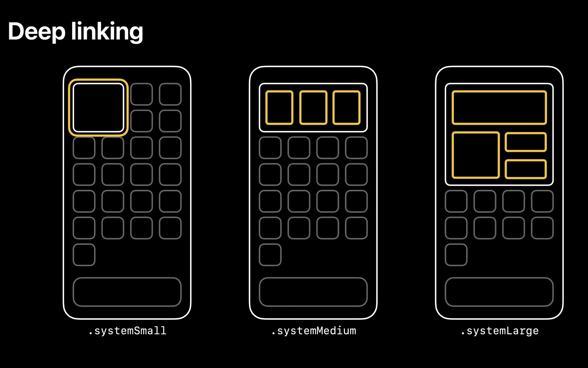

[toc]

# 1、创建 Widget Extension

在主工程里创建附属小组件：`Xcode` -> `File` -> `New` -> `Target` -> `iOS` -> `Widget Extension`：

- `Product Name`：`MOFitness`(起个名...)
- `Include Configuration Intent`：该`widget`是否支持用户自定义，即长按出现的菜单是否有编辑选项（如股票的`widget`，用户可以选择显示哪只股票）
- `Embed in Application`：(表示该`widget`是哪个`target`的附属品，如果`workspace`里有个`target`就要注意别选错了)  

-> `Finish`

如图：


----

# 2、Base Code

自动生成的文件 + 代码：
`MOWidget.swift`文件：主要的东西都在这里面
`MOWidget.intentdefinition`文件：自定义文件（支持自定义才有）
。。。（其它的很熟悉就不多说了）

## 2.1、Widget
首先从`@main`开始看，这是入口。		
```swift
@main
struct MOWidget: Widget { // 同名的Widget
  let kind: String = "MOWidget" // 刷新时用到
  // body：主要内容
  var body: some WidgetConfiguration { 
    // 这里支持两种Configuration：
    // StaticConfiguration：静态的
    // IntentConfiguration：自定义的，会多一个intent参数
    StaticConfiguration(kind: kind, provider: Provider()) { entry in
        MOWidgetEntryView(entry: entry) // 最终展示的View
    }
    .configurationDisplayName("My Widget") // 名字
    .description("This is an example widget.") // 描述
  }
}
```
名字和描述在添加时显示：


## 2.2、Entry

数据源
```swift
struct SimpleEntry: TimelineEntry {
  let date: Date // 默认的entry里，带了一个它刷新的时间
  
  // 支持自定义的还会带个configuration
  // let configuration: ConfigurationIntent
  
  // 可以在此加自己需要传入的数据
}
```
## 2.3、EntryView

```swift
struct MOWidgetEntryView : View { // 最终显示的View
  var entry: Provider.Entry // 数据
  var body: some View { // View
    Text(entry.date, style: .time) // 一个文本
  }
}
```

## 2.4、Provider（Timelines）
`Provider`里有三个方法：
- `placeholder`：返回占位的数据源
- `getSnapshot`：返回快照的数据源（小组件库里显示）
- `getTimeline`：返回时间线数组
```swift
// 占位视图，没有塞数据之前的显示，同步方法，需要快速返回
func placeholder(in context: Context) -> SimpleEntry {
    return SimpleEntry(date: Date())
}

// 小组件库里的显示
func getSnapshot(in context: Context, completion: @escaping (SimpleEntry) -> ()) {
	let entry = SimpleEntry(date: Date())
	completion(entry)
}

func getTimeline(in context: Context, completion: @escaping (Timeline<Entry>) -> ()) {
    var entries: [SimpleEntry] = []
	// 5个更新时间点，每小时一个
    let currentDate = Date()
    for hourOffset in 0 ..< 5 {
        let entryDate = Calendar.current.date(byAdding: .hour, value: hourOffset, to: currentDate)!
		// 网络请求后塞数据
        let entry = SimpleEntry(date: entryDate)
        entries.append(entry)
    }
    let timeline = Timeline(entries: entries, policy: .atEnd)
    completion(timeline)
}
```

`Timelines`：


`TimelineReloadPolicy`

- `atEnd`: 在以上`entries`数组的最后一个`entry`的时间后，请求新的`Timeline`
- `after(Date)`: 在给定的时间之后请求
- `never`: 不要自动请求

注：其实具体什么时候刷新，还是系统结合实际情况触发该方法（太频繁的刷新会被限制）

----

# 3、Families

新增`family`参数，可以根据不同的`family`返回不同的`view`：

```swift
struct MOWidgetEntryView : View {
  var entry: Provider.Entry
  
  // 获取当前family
  @Environment(\.widgetFamily) var family
  
  var body: some View {
    switch family {
    case .systemSmall: MOSmallView(data: MOFitnessData())
    case .systemMedium: MOMediumView(data: MOFitnessData())
    case .systemLarge: MOLargeView(data: MOFitnessData())
    }
  }
}
```


使用`.supportedFamilies(...)`可以设置`widget`支持的`families`：
```swift
@main
struct MOWidget: Widget {
  let kind: String = "MOWidget"
  var body: some WidgetConfiguration { 
    ...
    }
    .configurationDisplayName("My Widget")
    .supportedFamilies([.systemSmall, .systemMedium, .systemLarge])
  }
}  
```

# 4、Deep linking

使用`.widgetURL(URL)`可以给`widget`添加整体的点击`URL`：

```swift
struct MOWidgetEntryView : View {
  var entry: Provider.Entry
  @Environment(\.widgetFamily) var family
  
  var body: some View {
    switch family {
    case .systemSmall:
      MOSmallView(data: MOFitnessData())
        .widgetURL(URL(string: "mo.widget.small"))
    case .systemMedium:
      MOMediumView(data: MOFitnessData())
        .widgetURL(URL(string: "mo.widget.medium"))
		。。。
    }
  }
}
```
点击会打开主`app`就会触发：
```swift
func scene(_ scene: UIScene, openURLContexts URLContexts: Set<UIOpenURLContext>) {
  for context in URLContexts {
    print("context: \(context.url)")
  }
}
```
为某个视图设置点击`url`，可以使用`Link`。
```swift
Link(destination: URL(string: "mo.numberView.link")!) {
  MONumberView(data: data)
}
```

注：但是`.systemSmall` family 不能单独设置子视图的`Link`：

----
# 5、Configuration（SiriKit Intent）

新建`intentdefinition`文件：`New` -> `File` -> `iOS` -> `SiriKit Intent Definition File`
1-2、选中文件 -> `+` -> `New Intent` -> 命名
3-4、新增可配置参数 -> 选择类型：基础 or 自定义
5、自定义类型


效果：


支持后代码里都会相应的新增`configuration`参数：

如：`getTimeline`方法：
```swift
func getTimeline(for configuration: DeviceSelectionIntent, in context: Context, completion: @escaping (Timeline<MOSimpleEntry>) -> ()) {
	。。。
    print("getTimeline deviceType: \(configuration.device.rawValue)")
	。。。
}
```
----

# 6、Updating

## 6.1、Timeline的刷新
如上：2.3

## 6.2、手动刷新
我们可以在主`App`里触发刷新`widget`。

- swift文件里刷新

```swift
import WidgetKit // 导入WidgetKit
WidgetCenter.shared.reloadAllTimelines() // 刷新所有的widget
WidgetCenter.shared.reloadTimelines(ofKind: "MOWidget") // 刷新指定的widget
```

- OC文件里刷新

会比较麻烦：还是需要利用swift文件，加上一堆判断后调用刷新方法。

```swift
import WidgetKit

@objc
@available(iOS 14.0, *)
class WWWidgetManager: NSObject {
  @objc static let shared = WWWidgetManager()
  //MARK: - 刷新所有小组件
  @objc func reloadAllTimelines() {
    #if arch(arm64) || arch(i386) || arch(x86_64)
    WidgetCenter.shared.reloadAllTimelines()
    #endif
  }
  // MARK: - 刷新单个小组件
  @objc func reloadTimelines(kind: String) {
    #if arch(arm64) || arch(i386) || arch(x86_64)
    WidgetCenter.shared.reloadTimelines(ofKind: kind)
    #endif
  }
}
```
OC里利用桥接文件调用上面连个方法：
```objective-c
#import "MOWidgetDemo-Swift.h"
[[WWWidgetManager shared] reloadAllTimelines];
[[WWWidgetManager shared] reloadTimelines:@"MOWidget"];
```

----

# 7、DataSource

## 7.1、Networking

新建一个管理数据的请求和提供的类：`MODataSource.swift`

```swift
struct MODataSouce {
  static let shared = MODataSouce()
  // MARK: 请求数据
  func fetchData(fetchSuccess: @escaping (MOFitnessData) -> Void, fetchFailure: @escaping () -> Void) {
    // 模拟耗时网络请求
    DispatchQueue.main.asyncAfter(deadline: .now() + 1) {
      let success = true
      if success {
        fetchSuccess(MOFitnessData.shared)
      } else {
        fetchFailure()
      }
    }
  }
}
```
在`getTimeline`方法里就可以这样使用：
```swift
func getTimeline(for configuration: ConfigurationIntent, in context: Context, completion: @escaping (Timeline<MOSimpleEntry>) -> ()) {
  var entries: [MOSimpleEntry] = []
  let currentDate = Date()
  // 因为是实时的数据，不应提前加载，所以设置每3分钟刷新一次
  let entryDate = Calendar.current.date(byAdding: .minute, value: 3, to: currentDate)!
  MODataSouce.shared.fetchData { (data) in
    // 请求成功
    let entry = MOSimpleEntry(date: entryDate, configuration: configuration, data: data)
    entries.append(entry)
    let timeline = Timeline(entries: entries, policy: .atEnd)
    completion(timeline)
  } fetchFailure: {
    // 请求失败
    let timeline = Timeline(entries: entries, policy: .atEnd)
    completion(timeline)
  }
}
```
Tips：跑主`App`的时候`widget`的`log`是打印不出来的，需要先跑起来主`app`，再跑`widget`，就看到`widget`的`log`了~

----

## 7.2、DataShare
跟主App共享数据可以通过`App Group`的方式实现：
在开发者账号的官网开启`App Group`功能，并设置ID；
`Xcode`中主`app`和`widget`的 `target` -> `Signing & Capabilities` 中添加`App Groups`，并输入`ID`。

通过`AppGroupID`获取`UserDefaults`进行的数据读写就可以共享了。

```swift
class WWAppGroupManager: NSObject {
  static let kAppGroupIdentify = "group.mo.widget"
  static let kUserInfoKey = "user_info"
  
  // MARK: - 保存用户信息
  @objc static func setUserInfo(_ info: [AnyHashable : Any]) {
    let userDefaults = UserDefaults(suiteName: kAppGroupIdentify)
    userDefaults?.setValue(info, forKey: kUserInfoKey)
  }
  
  // MARK: - 获取用户信息
  @objc static func getUserInfo() -> [AnyHashable : Any]? {
    let userDefaults = UserDefaults(suiteName: kAppGroupIdentify)
    guard let info: [AnyHashable : Any] = userDefaults?.value(forKey: kUserInfoKey) as? [AnyHashable : Any] else {
      print("app group: get user nil")
      return nil
    }
    return info
  }
}
```
可把这个文件共享给`widget target`，在做网络请求时直接使用就好了~

----

# 8、SwiftUI

桌面`widget`是`iOS14`才推出的，所以`Apple`强制`UI`使用`SwiftUI`来实现。
（`SwiftUI`比`OC`的`UI`方便多了~）

## 8.1、Preview

`UI`调试必备`Canvas`，打开方式：


用到了`PreviewProvider`，可以设置显示的`family`、`device`、等等：

```swift
struct MOWidget_Previews: PreviewProvider {
  static var previews: some View {
    Group {
      ForEach(["iPhone 12 mini", "iPhone 12", "iPhone 12 Pro Max"], id: \.self) { deviceName in
        MOWidgetEntryView(entry: MOSimpleEntry(date: Date(), configuration: ConfigurationIntent(), data: MOFitnessData()))
          .previewContext(WidgetPreviewContext(family: .systemSmall)) // small
          .previewDevice(PreviewDevice(rawValue: deviceName)) // device
        
        MOWidgetEntryView(entry: MOSimpleEntry(date: Date(), configuration: ConfigurationIntent(), data: MOFitnessData()))
          .previewContext(WidgetPreviewContext(family: .systemMedium)) // medium
          .previewDevice(PreviewDevice(rawValue: deviceName))
      }
    }
  }
}
```
Tips：固定`Canvas`：`Canvas`左下角有个“图钉”（`Pin Preview`），选中就固定显示当前文件的`preview`了。切换到其它文件修改代码，也可以看到当前固定类的实时更新。

----

## 8.2、BaseUI
了解以下基础的UI后，就可以开始铺页面了。
`View`、`Text`、`HStack`、`VStack`、`ZStack`、`Spacer`、`Circle`、等等
`GeometryReader`、`alignment`、`frame`、`padding`、等等

PS. 没接触过的，这里推荐两个快速上手的视频：[【十五分钟搞懂SwiftUI】布局篇](https://www.bilibili.com/video/BV1Ht4y1y7CE)、[【十五分钟搞懂SwiftUI】样式篇](https://www.bilibili.com/video/BV1o54y1i7xJ)

## 8.3、尺寸适配

各个屏幕尺寸上`widget`的`size`：


### 8.3.1、利用`GeometryReader`

```swift
// SmallView里，运用GeometryReader可以获取到提供的size
var body: some View {
  GeometryReader { geometry in
    Spacer().frame(height: setScreenHeight(geometry.size.height))
  }
}
// Commons.swift
// 全局变量
var kScale: CGFloat = 1.0
// 全局方法
public func setScreenHeight(_ screenHeight: CGFloat) -> CGFloat {
  kScale = screenHeight / 169.0 // 此时比例就保存下来啦
  return 0.0
}
```
在后面的`UI`里，`fontSize`、`height`、`width`、`padding`等，都可以乘以`kScale`实现自适应啦

### 8.3.2、利用`context.displaySize`
`placeholder`、`getSnapshot`、`getTimeline`方法带回的`context`可以去到当前`widget`的`size`。进行适配～～
``` swift
func getTimeline(for configuration: DeviceSelectionIntent, in context: Context, completion: @escaping (Timeline<MOSimpleEntry>) -> ()) {
    let size: CGSize = context.displaySize;
		...
    let entry = MOSimpleEntry(date: entryDate, configuration: configuration, data: data)
		...
}
```
----

## 8.4、light、dark模式适配
新建`Color`：`Assets.xcassets` -> `+` -> `Color set` -> 可以分别设置`light`和`dark`模式下的色值


Tips：`Simulator`更改模式：`settings` -> `Developer` -> `Dark Appearance`

----
## 8.5、国际化

1）创建`string`文件：`Xcode` -> `File` -> `New` -> `File` -> `iOS` -> `String File` （或者 Com + N）：`Localizable.strings`
2）选中`Localizable.strings`文件，在右边的导航栏点击`Loalize...`按钮 ，再点击 `Loalize`
3）然后在`Project` -> `Info` -> `Localiztions` 中添加需要支持的语言。。。

```swift
NSLocalizedString("widget.actives", comment: "actives")
```
注：`widget`的`name`和`description`直接写`key`就行，不需要用`NSLocalizedString`：[参考](https://developer.apple.com/forums/thread/663091)
```swift
...
.configurationDisplayName("widget.name")
.description("widget.description")
```

----

# 9、Multiple

## 9.1、Widget bundles

支持多个`widget`需要用到`WidgetBundle`（最多支持5个）。
需要把之前`widget`上的`@main`删除掉。
然后：

```swift
@main
struct MOWigets: WidgetBundle {
  var body: some Widget {
    MOWidgetFitness()
    MOWidgetSecond()
    // ...
  }
}
```


## 9.2、一个widget支持多个target

需求：需要为workspace里的海外和国内两个Target新增widget。
只能新建一个`widget extension`， `Embed` 到另一个target上。
然后跟两个`widget extension`共享一切能共享的。

----
[github demo](https://github.com/mxh-mo/iOS14_Widget) ：类似`iWatch`的`运动健康`桌面小组件`Fitness widget`


----

参考：
[Apple Demo](https://developer.apple.com/documentation/widgetkit/building_widgets_using_widgetkit_and_swiftui)
[Creating a Widget Extension](https://developer.apple.com/documentation/WidgetKit/Creating-a-Widget-Extension)
[Keeping a Widget Up To Date](https://developer.apple.com/documentation/WidgetKit/Keeping-a-Widget-Up-To-Date)
[Human Interface Guidelines - Widgets](https://developer.apple.com/design/human-interface-guidelines/ios/system-capabilities/widgets)
[SwiftUI](https://developer.apple.com/documentation/swiftui)
